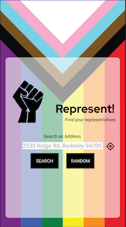

# PROG 02: Represent!

Represent! is a mobile app that displays current U.S. representatives for a given address. It allows users to search an address either manually, by using their current location, or a randomly selected zip code.

## Author

Deanna Gelosi (gelosi@berkeley.edu)

## Video Link

https://youtu.be/K4qNXHSsSGo
